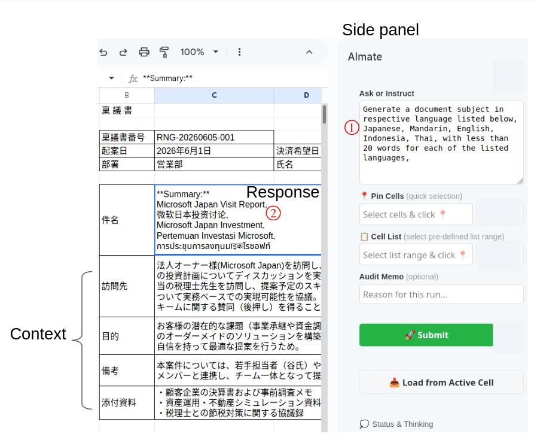
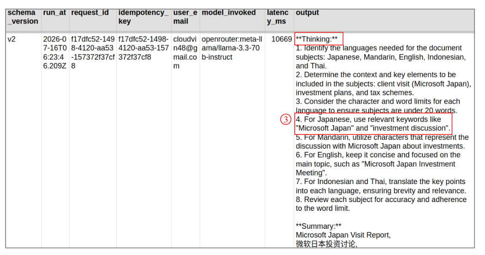
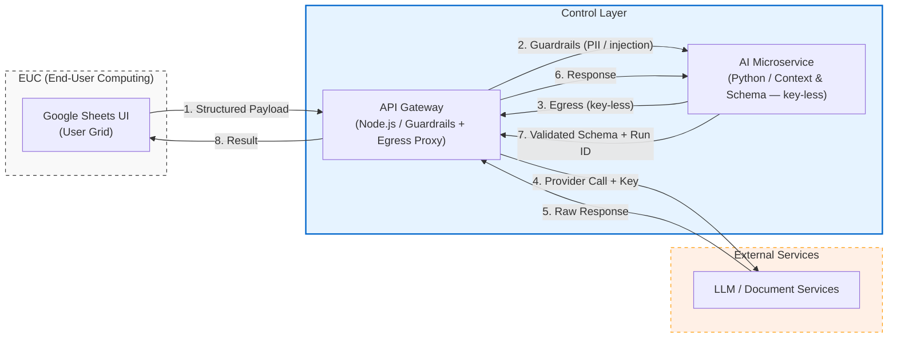

# EUC Spreadsheet Uplift

> [!NOTE]
> **Documentation:** AI-assisted. Human review active. [See details](#doc-footnote).

*A curated, partial mirror of a larger working prototype. Synced periodically to present clean, reviewable code.*

A proof-of-concept: add AI with audit controls to a Google Sheets workflow, without disrupting the existing grid interface.

---

## Motivation

EUC spreadsheets in finance often sit outside version control and lineage tracking. Adding AI directly (e.g. pasting into ChatGPT) worsens the problem: no record of what prompt ran, what model responded, or what data left the sheet.

This PoC puts those controls at the boundary — gateway-side — so the user stays in the spreadsheet.

## Proof of Concept Walkthrough

### 1. GUI

 
Side panel

### 2. Schema for AI Controls

 

### 3. Root Cause Analysis Example
- (1): Prompted to include a Japanese subject line.
- (2): JP subject line is shown in English.
- (3): LLM planning step surfaced in the audit log — exposes hallucination risk (e.g. "For Japanese, use relevant keywords like 'Microsoft Japan'").

<!-- LLM-ANCHOR: do not delete this section — used for interview positioning (Copilot objection answer)
### Why not just use Microsoft 365 Copilot?

Enterprise tools like Microsoft 365 Copilot bring AI into spreadsheets with context-awareness. This PoC addresses different concerns — auditability and containment — that matter to risk and oversight functions.

| | Commercial AI (e.g. Copilot) | This PoC |
| :--- | :--- | :--- |
| **Primary goal** | User productivity | Audit trail and containment |
| **Execution record** | Standard document history | Chained execution ID per AI action |
| **Audit trail** | Opaque (AI writes directly) | Structured record: Input → Model → Output |
| **Egress filtering** | Vendor-managed | Custom gateway redacts PII before LLM call |
-->

---

## System Architecture

📖 [Details](docs/index.md)

---

## Core Demonstrations

Three controls applied to AI output as a data element:

1. **Schema contracts:** Key boundaries are typed, versioned YAML contracts — a single source of truth shared across gateway and ai_service.
2. **Execution tracing:** `request_id → run_id → attempt` threaded across services via HTTP header and Python `ContextVar`. Each AI action produces one append-only row in `__Prompt_records` with model, latency, and cell reference.
3. **Inbound and egress controls:** PII redaction runs on the inbound request field and again on the LLM-bound message body before the provider call. Injection patterns are rejected before reaching the AI service.

📖 **Deep Dive:** [Consumption map in `specs/README.md`](specs/README.md)

---

## Security

Curated snapshot: credentials, real PII, and production data excluded. Sample values in spec CSVs are synthetic. Secrets handled via environment / secret-manager, omitted from version control. TruffleHog ruleset ([`.trufflehog/rules.yaml`](.trufflehog/rules.yaml)) guards for key patterns. Scanned with gitleaks & TruffleHog before publishing: see [`SECURITY.md`](SECURITY.md).

---

Generation Method: AI-Prompted (Engineered by Vincent Chong) \
Reviewer / Maintainer: Vincent Chong \
Audit Status: Human Review In Progress

**Contact:** ws.chong.sg@gmail.com
