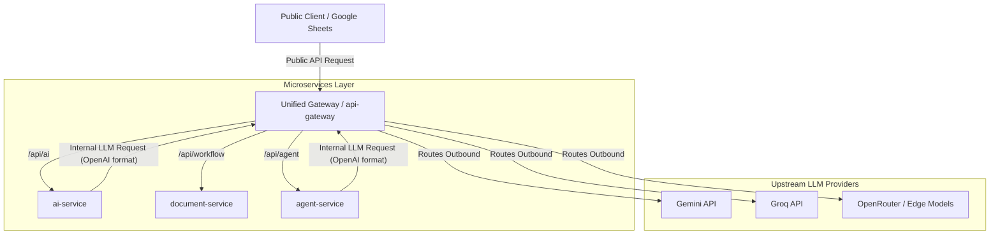

# Architectural Plan: Unified Gateway Architecture

This plan details a pragmatic **Unified Gateway** design. Instead of running a separate LLM Proxy container, we merge the egress LLM routing responsibilities directly into the existing, Node.js-based **Service Gateway (`api-gateway`)**.



---

## 1. Gateway Responsibilities

Under this unified design, the `api-gateway` handles both incoming public traffic and outgoing LLM requests:

1. **Public Ingress Route**: Maps public routes (like `/api/ai`) to the local `ai-service` container.
2. **Internal Egress LLM Proxy Route**: Exposes an internal endpoint (e.g., `/internal/v1/chat/completions`) for microservices inside the Docker network.
3. **Secret Isolation**: All external API keys (`GEMINI_API_KEY`, `GROQ_API_KEY`, etc.) reside strictly inside the `api-gateway` environment.

---

## 2. Advantages of the Unified Gateway

*   **No Infrastructure Bloat**: Removes the need to run and maintain a separate `agy_api_proxy` container.
*   **Reduced Latency**: Cuts out a network hop and serialization layer from the execution path.
*   **Centralized Config**: A single `.env` file and routing manifest configure all network endpoints.

---

## 3. Implementation Steps

### Step 1: Update API Gateway Routes
Add an internal proxy route configuration inside `api-gateway`. It will forward requests matching `/internal/v1/chat` directly to the desired upstream provider (e.g. Groq, Gemini) based on headers or configuration.

### Step 2: Configure internal service connections
Update the microservices (like `ai-service`) to point their base LLM URL to the gateway container:
```env
LLM_BASE_URL=http://api-gateway:3000/internal/v1
LLM_MODEL=gemini-3.5-flash-low
```
