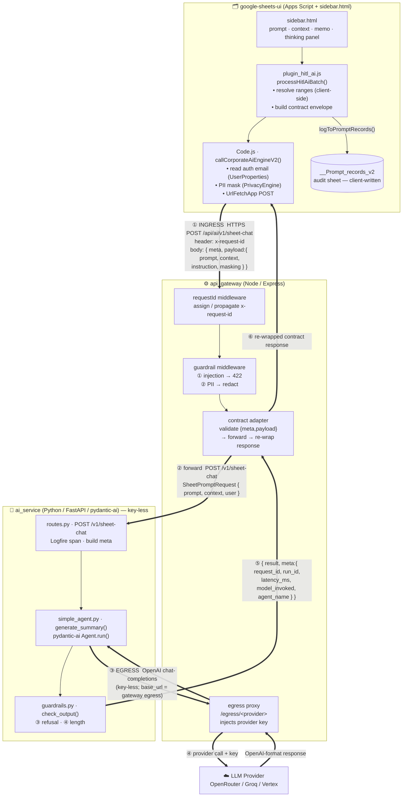

# 08 · Component Interfaces — Sheets UI ↔ Gateway ↔ AI Service

Block diagram of the **contracts and responsibilities** across the three
components on the synchronous AI path. Shows *what crosses each boundary* — not
internal logic (see each component's own page for that).

> Scope: the **currently implemented** single-turn path
> (`/api/ai/v1/sheet-chat`). The future streaming/agentic path is noted at the
> bottom.
>
> Terminology: **ingress** = *inbound* (a request entering our system);
> **egress** = *outbound* (a call our system makes to an external service).

---

## Interface block diagram

---

## Boundary contracts (what each interface guarantees)

| # | Boundary | Direction | Payload / contract | Call artifacts |
|---|---|---|---|---|
| ① | Sheets UI → Gateway | ingress | Contract envelope `{ meta, payload }`; `x-request-id` header; prompt/context **already PII-masked client-side** | `apps/google-sheets-ui/Code.js` — `PrivacyEngine.mask()` → vault; `UrlFetchApp.fetch()` |
| ② | Gateway → AI Service | internal | `SheetPromptRequest { prompt, context, user }`; guardrail-cleaned | `apps/api_gateway/middleware/guardrails.mjs` — rules from `specs/guardrail.yaml` (`GUARDRAIL_PATH`) |
| ③ | AI Service → Gateway | egress | Plain **OpenAI chat-completions**, key-less (base_url points at gateway egress) | `apps/ai_service/app/agents/simple_agent.py` — `agent.run()` via `OpenAIProvider(base_url=LLM_BASE_URL)` |
| ④ | Gateway → Provider | egress | Same body **+ injected provider credential** | `apps/api_gateway/routes/egress.mjs` — injects `LLM_PROVIDER` key from env |
| ⑤ | AI Service → Gateway | return | `{ result, meta:{ request_id, run_id, latency_ms, model_invoked, agent_name, timestamp } }` | `apps/ai_service/app/api/routes.py` — `post_sheet_chat()` response envelope |
| ⑥ | Gateway → Sheets UI | return | Re-wrapped contract response; client re-hydrates PII, writes cell + audit row | `apps/google-sheets-ui/Code.js` — `PrivacyEngine.rehydrate()` → vault; `logToPromptRecords()` |

## Responsibility split (key facts)

- **Range resolution is client-side.** `ai_service` never reads Sheets — it
  receives `context` as a pre-resolved string. It is **key-less and isolated**.
- **`__Prompt_records_v2` is written by the Apps Script client**, not by
  `ai_service`. The sheet is a *human-readable mirror*, not the system of record
  (see [07-security-auditability.md](07-security-auditability.md) §4).
- **Provider credentials live only in the gateway egress** — `ai_service` stays
  key-less ([05-egress-llm.md](05-egress-llm.md)).
- **Two guardrail layers**: input at the gateway (injection/PII), output at
  `ai_service` (refusal/length).
- **`x-request-id` is the correlation key** propagated across every hop.

## Known interface gaps (tracked)

- **No verified identity crosses ①.** `meta.user` is an *unsigned claim*; the
  gateway does not authenticate it — top production risk
  ([07-security-auditability.md](07-security-auditability.md) §1).
- Response is **single-shot JSON** — no intermediate progress. See the future
  streaming path below.

## Future: streaming / agentic path (not yet implemented)

For long agentic runs, a second interface is added **alongside** ①: the browser
streams directly from the gateway over SSE (`text/event-stream`), authenticated
by a Google-signed OIDC token minted server-side by Apps Script and verified at
the gateway. `ai_service` emits curated `thinking` milestones via
`StreamingResponse`. This does **not** replace the sync path — it augments it.
The end-to-end sequence for both is in
[09-end-to-end-sequence.md](09-end-to-end-sequence.md).
